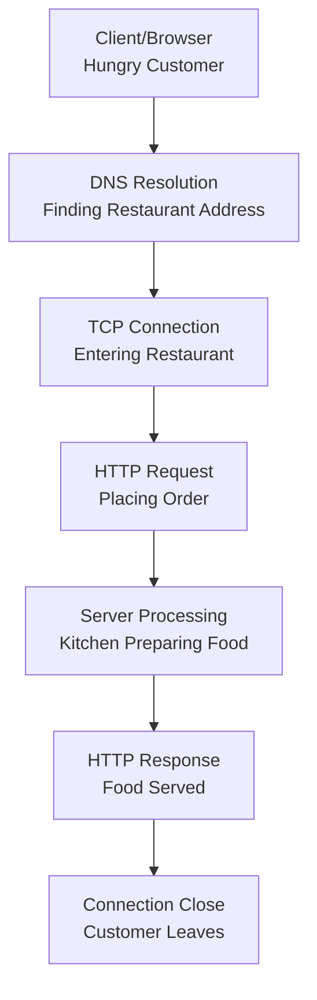
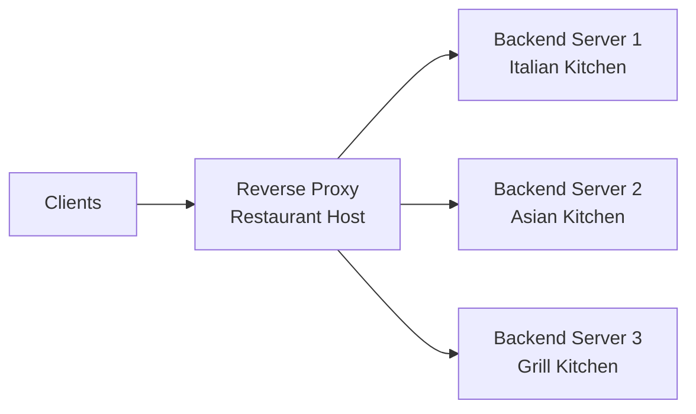
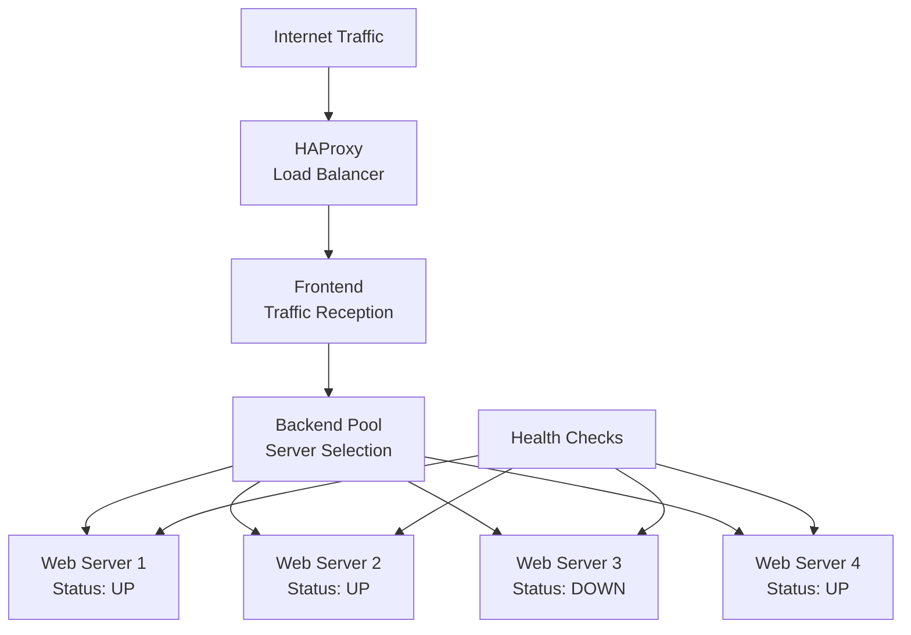
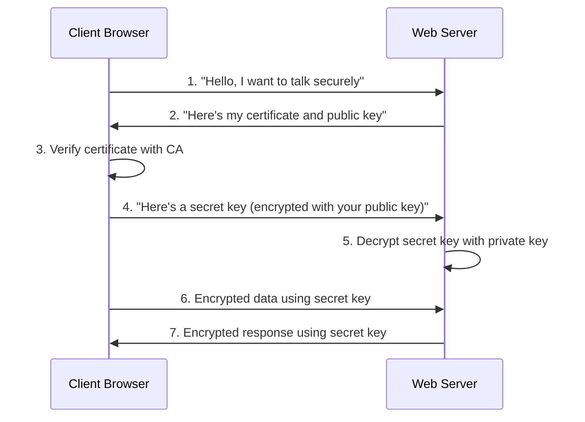
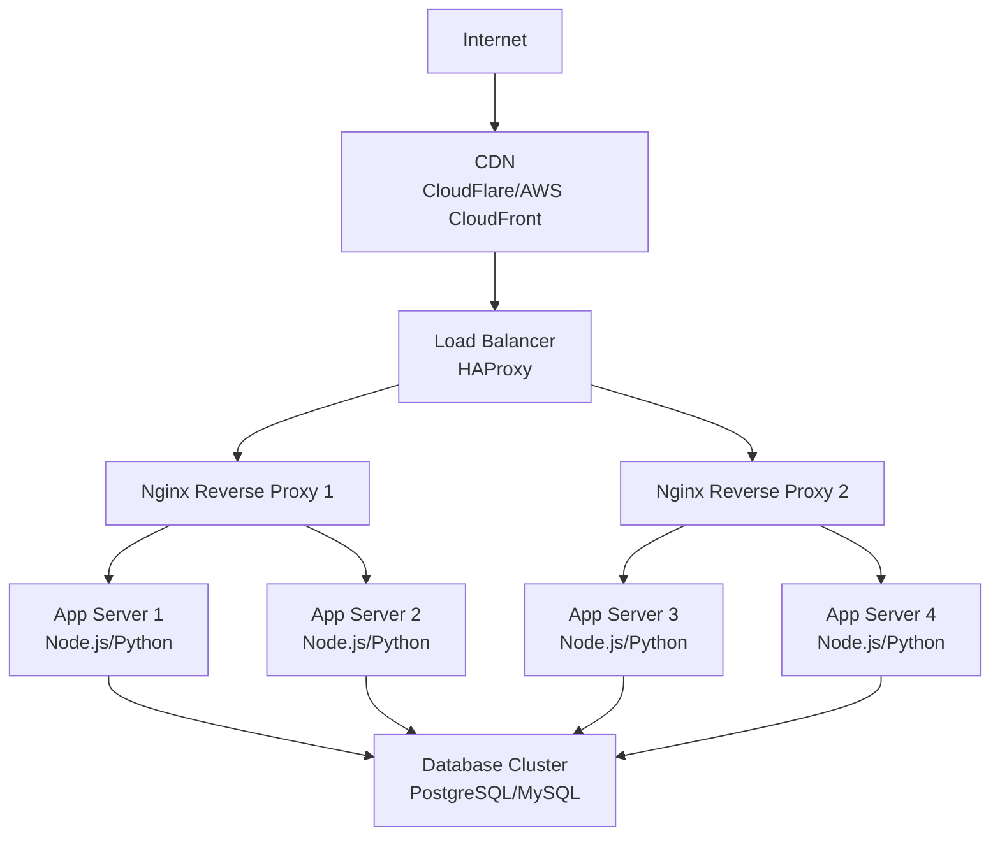
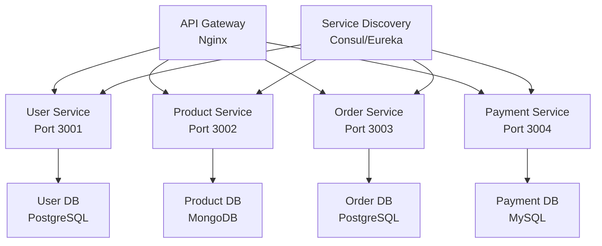
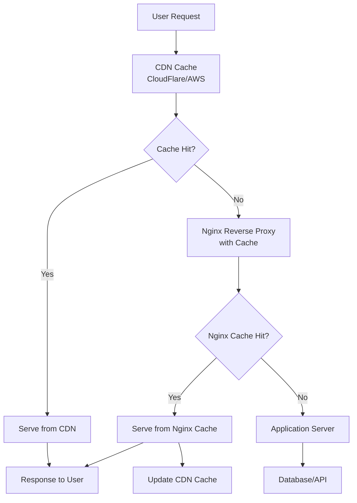

# Complete Guide to Server Basics and Configuration

---

## Table of Contents

1. [Server Basics: Understanding the Foundation](#server-basics)
2. [How Servers Work: The Restaurant Analogy](#how-servers-work)
3. [Web Servers vs Reverse Proxies](#web-servers-vs-reverse-proxies)
4. [Nginx: The Swiss Army Knife](#nginx)
5. [HAProxy: The Load Balancing Master](#haproxy)
6. [SSL/TLS: Securing Your Communications](#ssl-tls)
7. [Real-World Configurations](#real-world-configurations)
8. [Common Use Cases and Patterns](#use-cases)
9. [Troubleshooting Guide](#troubleshooting)

---

## Server Basics: Understanding the Foundation {#server-basics}

### What is a Server?

Think of a server like a restaurant kitchen. Just as a kitchen receives orders from customers, prepares food, and sends it back through waiters, a server receives requests from clients (like web browsers), processes them, and sends back responses.

**Key Components:**
- **Hardware**: The physical machine (like the kitchen equipment)
- **Operating System**: The manager that coordinates everything (like the head chef)
- **Server Software**: The specialized workers (like cooks for different cuisines)
- **Network Interface**: The connection to the outside world (like the restaurant's front door)

### Types of Servers

| Server Type | Purpose | Restaurant Analogy |
|-------------|---------|-------------------|
| **Web Server** | Serves web pages and static content | The main dining area serving standard menu items |
| **Application Server** | Runs business logic and dynamic content | The specialty kitchen for complex dishes |
| **Database Server** | Stores and retrieves data | The pantry and inventory system |
| **Proxy Server** | Acts as an intermediary | The maître d' who directs customers |
| **Load Balancer** | Distributes traffic across multiple servers | The host who distributes customers across multiple dining rooms |

---

## How Servers Work: The Restaurant Analogy {#how-servers-work}

### The Complete Request-Response Cycle



### Step-by-Step Breakdown

1. **DNS Resolution** (Finding the Restaurant)
   - Client asks: "Where is google.com?"
   - DNS server responds: "It's at 172.217.14.196"
   - Like asking for directions to your favorite restaurant

2. **TCP Handshake** (Entering the Restaurant)
   - Client knocks on the server's door
   - Server acknowledges and opens the door
   - Connection established (you're seated at a table)

3. **HTTP Request** (Placing Your Order)
   ```
   GET /index.html HTTP/1.1
   Host: example.com
   User-Agent: Chrome/91.0
   ```
   - Like telling the waiter: "I'd like the house special"

4. **Server Processing** (Kitchen Preparation)
   - Server finds the requested resource
   - Processes any dynamic content
   - Prepares the response

5. **HTTP Response** (Food is Served)
   ```
   HTTP/1.1 200 OK
   Content-Type: text/html
   Content-Length: 1234
   
   <html>...</html>
   ```

---

## Web Servers vs Reverse Proxies {#web-servers-vs-reverse-proxies}

### Web Servers: The Direct Servers

A web server is like a small café where the owner directly serves customers:

**Popular Web Servers:**
- **Apache HTTP Server**: The reliable veteran (like an established family restaurant)
- **Nginx**: The efficient modern choice (like a trendy fast-casual spot)
- **IIS**: Microsoft's offering (like a franchise restaurant)

**What Web Servers Do:**
- Serve static files (HTML, CSS, JavaScript, images)
- Handle HTTP/HTTPS protocols
- Manage basic authentication
- Log requests and errors

### Reverse Proxies: The Smart Intermediaries

A reverse proxy is like a sophisticated restaurant chain's front desk that:
- Takes customer requests
- Decides which kitchen should prepare the order
- Delivers the food back to customers
- Handles complaints and special requests



**Key Benefits:**
- **Load Distribution**: Spread customers across multiple kitchens
- **SSL Termination**: Handle all the payment processing at the front desk
- **Caching**: Keep popular dishes ready to serve immediately
- **Security**: Screen customers before they reach the kitchen

---

## Nginx: The Swiss Army Knife {#nginx}

### What Makes Nginx Special?

Nginx (pronounced "engine-x") is like having a super-efficient restaurant manager who can:
- Serve customers directly for simple requests
- Coordinate with multiple kitchens for complex orders
- Handle thousands of customers simultaneously
- Keep everything running smoothly under pressure

### Key Features

| Feature | Description | Restaurant Analogy |
|---------|-------------|-------------------|
| **High Performance** | Handles 10,000+ concurrent connections | Can manage a huge dining hall without breaking a sweat |
| **Low Memory Usage** | Efficient resource utilization | Doesn't waste ingredients or space |
| **Reverse Proxy** | Routes requests to backend servers | Directs orders to the right kitchen |
| **Load Balancing** | Distributes traffic evenly | Ensures no kitchen gets overwhelmed |
| **SSL Termination** | Handles encryption/decryption | Manages all payment processing |
| **Static File Serving** | Efficiently serves files | Quickly serves bread, water, and simple items |

### Basic Nginx Configuration

```nginx
# Main configuration file: /etc/nginx/nginx.conf

# Global settings (Restaurant policies)
user www-data;
worker_processes auto;  # Number of workers (kitchen staff)
pid /run/nginx.pid;

events {
    worker_connections 1024;  # Max customers per worker
    use epoll;  # Efficient connection handling
}

http {
    # Basic settings
    sendfile on;
    tcp_nopush on;
    tcp_nodelay on;
    keepalive_timeout 65;
    types_hash_max_size 2048;

    # MIME types
    include /etc/nginx/mime.types;
    default_type application/octet-stream;

    # Logging (Restaurant records)
    access_log /var/log/nginx/access.log;
    error_log /var/log/nginx/error.log;

    # Gzip compression (Efficient food packaging)
    gzip on;
    gzip_vary on;
    gzip_min_length 1024;
    gzip_types text/plain text/css application/json application/javascript;

    # Server blocks (Individual restaurant locations)
    server {
        listen 80;  # Port (restaurant address)
        server_name example.com www.example.com;  # Domain names
        
        # Document root (kitchen location)
        root /var/www/html;
        index index.html index.php;

        # Location blocks (menu sections)
        location / {
            try_files $uri $uri/ =404;
        }

        location /api/ {
            proxy_pass http://backend_servers;
            proxy_set_header Host $host;
            proxy_set_header X-Real-IP $remote_addr;
        }

        location ~* \.(css|js|png|jpg|jpeg|gif|ico|svg)$ {
            expires 1y;  # Cache static files for a year
            add_header Cache-Control "public, immutable";
        }
    }
}
```

### Common Nginx Use Cases

#### 1. Simple Web Server
```nginx
server {
    listen 80;
    server_name mysite.com;
    root /var/www/mysite;
    
    location / {
        try_files $uri $uri/ /index.html;
    }
}
```

#### 2. Reverse Proxy for Node.js App
```nginx
upstream nodejs_app {
    server 127.0.0.1:3000;
    server 127.0.0.1:3001;
    server 127.0.0.1:3002;
}

server {
    listen 80;
    server_name myapp.com;
    
    location / {
        proxy_pass http://nodejs_app;
        proxy_set_header Host $host;
        proxy_set_header X-Real-IP $remote_addr;
        proxy_set_header X-Forwarded-For $proxy_add_x_forwarded_for;
        proxy_set_header X-Forwarded-Proto $scheme;
    }
}
```

#### 3. Load Balancing with Health Checks
```nginx
upstream backend {
    least_conn;  # Load balancing method
    server backend1.example.com:8080 weight=3;
    server backend2.example.com:8080 weight=2;
    server backend3.example.com:8080 backup;  # Only used if others fail
}

server {
    listen 80;
    server_name loadbalanced.com;
    
    location / {
        proxy_pass http://backend;
        proxy_next_upstream error timeout http_500 http_502 http_503;
        proxy_connect_timeout 2s;
        proxy_read_timeout 10s;
    }
}
```

---

## HAProxy: The Load Balancing Master {#haproxy}

### What is HAProxy?

HAProxy is like the world's best restaurant chain coordinator. While Nginx is a great local manager, HAProxy is the regional director who:
- Monitors all restaurant locations constantly
- Instantly redirects customers from busy locations to available ones
- Tracks the health of each kitchen in real-time
- Makes intelligent decisions about customer distribution

### HAProxy vs Nginx Comparison

| Feature | HAProxy | Nginx | Best Use Case |
|---------|---------|-------|---------------|
| **Load Balancing** | ⭐⭐⭐⭐⭐ Advanced algorithms | ⭐⭐⭐ Good basic options | HAProxy for complex scenarios |
| **Health Checks** | ⭐⭐⭐⭐⭐ Sophisticated monitoring | ⭐⭐⭐ Basic checks | HAProxy for critical systems |
| **Static Content** | ⭐⭐ Limited capability | ⭐⭐⭐⭐⭐ Excellent performance | Nginx for static files |
| **Configuration** | ⭐⭐⭐ More complex | ⭐⭐⭐⭐ User-friendly | Nginx for simplicity |
| **SSL Termination** | ⭐⭐⭐⭐ Good support | ⭐⭐⭐⭐⭐ Excellent support | Nginx for SSL-heavy sites |
| **Monitoring** | ⭐⭐⭐⭐⭐ Built-in stats page | ⭐⭐⭐ Requires modules | HAProxy for detailed monitoring |

### HAProxy Architecture



### Basic HAProxy Configuration

```haproxy
# Global settings (Company-wide policies)
global
    daemon
    chroot /var/lib/haproxy
    user haproxy
    group haproxy
    pidfile /var/run/haproxy.pid
    
    # Performance tuning
    maxconn 4000
    nbproc 2  # Number of processes
    
    # SSL settings
    ssl-default-bind-options no-sslv3 no-tlsv10 no-tlsv11
    ssl-default-bind-ciphers ECDHE+AESGCM:ECDHE+CHACHA20:DHE+AESGCM

# Default settings for all sections
defaults
    mode http
    timeout connect 5000ms
    timeout client 50000ms
    timeout server 50000ms
    
    # Logging
    option httplog
    option dontlognull
    
    # Error handling
    errorfile 400 /etc/haproxy/errors/400.http
    errorfile 403 /etc/haproxy/errors/403.http
    errorfile 408 /etc/haproxy/errors/408.http
    errorfile 500 /etc/haproxy/errors/500.http
    errorfile 502 /etc/haproxy/errors/502.http
    errorfile 503 /etc/haproxy/errors/503.http
    errorfile 504 /etc/haproxy/errors/504.http

# Frontend (Reception desk)
frontend web_frontend
    bind *:80
    bind *:443 ssl crt /etc/ssl/certs/example.com.pem
    
    # Redirect HTTP to HTTPS
    redirect scheme https if !{ ssl_fc }
    
    # Route to appropriate backend
    use_backend api_servers if { path_beg /api }
    use_backend static_servers if { path_beg /static }
    default_backend web_servers

# Backend configurations (Kitchen assignments)
backend web_servers
    balance roundrobin  # Load balancing algorithm
    
    # Health check configuration
    option httpchk GET /health
    http-check expect status 200
    
    # Server definitions
    server web1 192.168.1.10:8080 check weight 1
    server web2 192.168.1.11:8080 check weight 1
    server web3 192.168.1.12:8080 check weight 1 backup

backend api_servers
    balance leastconn  # Send to server with fewest connections
    
    option httpchk GET /api/health
    http-check expect string "healthy"
    
    server api1 192.168.1.20:3000 check
    server api2 192.168.1.21:3000 check
    server api3 192.168.1.22:3000 check

backend static_servers
    balance source  # Consistent server based on client IP
    
    server static1 192.168.1.30:80 check
    server static2 192.168.1.31:80 check

# Statistics page (Management dashboard)
frontend stats
    bind *:8080
    stats enable
    stats uri /stats
    stats refresh 30s
    stats admin if TRUE
```

### Advanced HAProxy Features

#### 1. Sophisticated Health Checks
```haproxy
backend database_servers
    # HTTP health check with custom headers
    option httpchk POST /health/db HTTP/1.1
    http-check send-state
    http-check expect status 200
    http-check expect string "database_ok"
    
    # TCP health check for non-HTTP services
    # option tcp-check
    
    server db1 db1.example.com:5432 check inter 2000 rise 2 fall 3
    server db2 db2.example.com:5432 check inter 2000 rise 2 fall 3
```

#### 2. Advanced Load Balancing Algorithms
```haproxy
backend smart_servers
    # Available algorithms:
    # roundrobin - Each server in turn
    # leastconn - Server with fewest connections
    # source - Based on client IP hash
    # uri - Based on URI hash
    # hdr(header) - Based on HTTP header hash
    # rdp-cookie - For RDP load balancing
    
    balance uri
    hash-type consistent  # Consistent hashing
    
    server app1 app1.example.com:8080 check
    server app2 app2.example.com:8080 check
    server app3 app3.example.com:8080 check
```

#### 3. SSL Termination and Security
```haproxy
frontend secure_frontend
    bind *:443 ssl crt /etc/ssl/certs/
    
    # Security headers
    http-response set-header Strict-Transport-Security max-age=31536000
    http-response set-header X-Frame-Options DENY
    http-response set-header X-Content-Type-Options nosniff
    
    # Rate limiting
    stick-table type ip size 100k expire 30s store http_req_rate(10s)
    http-request track-sc0 src
    http-request deny if { sc_http_req_rate(0) gt 20 }
```

---

## SSL/TLS: Securing Your Communications {#ssl-tls}

### Understanding SSL/TLS with Analogies

Think of SSL/TLS like sending a love letter in a locked box:

1. **Without SSL** (HTTP): Writing a postcard - anyone can read it
2. **With SSL** (HTTPS): Putting the letter in a locked box with a special key

### How SSL/TLS Works



### Certificate Components

| Component | Purpose | Analogy |
|-----------|---------|---------|
| **Certificate** | Digital passport | Your driver's license |
| **Public Key** | Lock that everyone can see | Mailbox slot |
| **Private Key** | Key only you have | Mailbox key |
| **Certificate Authority (CA)** | Trusted verifier | Government that issued your license |
| **Certificate Chain** | Chain of trust | References on your job application |

### Generating SSL Certificates

#### 1. Self-Signed Certificate (Development)
```bash
# Generate private key
openssl genrsa -out server.key 2048

# Generate certificate signing request
openssl req -new -key server.key -out server.csr

# Generate self-signed certificate
openssl x509 -req -days 365 -in server.csr -signkey server.key -out server.crt

# Combine for nginx
cat server.crt server.key > server.pem
```

#### 2. Let's Encrypt (Free Production Certificates)
```bash
# Install certbot
sudo apt-get install certbot python3-certbot-nginx

# Get certificate
sudo certbot --nginx -d example.com -d www.example.com

# Auto-renewal (add to crontab)
0 12 * * * /usr/bin/certbot renew --quiet
```

#### 3. Commercial Certificate Process
```bash
# 1. Generate private key
openssl genrsa -out example.com.key 2048

# 2. Generate CSR
openssl req -new -key example.com.key -out example.com.csr
# Fill in: Country, State, City, Organization, Unit, Common Name, Email

# 3. Submit CSR to CA (like DigiCert, Comodo, etc.)
# 4. Verify domain ownership (email, DNS, or file verification)
# 5. Download issued certificate
# 6. Install certificate on server
```

### SSL Configuration in Nginx

```nginx
server {
    listen 80;
    server_name example.com www.example.com;
    
    # Redirect all HTTP to HTTPS
    return 301 https://$server_name$request_uri;
}

server {
    listen 443 ssl http2;
    server_name example.com www.example.com;
    
    # SSL Certificate configuration
    ssl_certificate /etc/ssl/certs/example.com.crt;
    ssl_certificate_key /etc/ssl/private/example.com.key;
    
    # SSL Security settings
    ssl_protocols TLSv1.2 TLSv1.3;
    ssl_ciphers ECDHE+AESGCM:ECDHE+CHACHA20:DHE+AESGCM:DHE+CHACHA20:!aNULL:!MD5:!DSS;
    ssl_prefer_server_ciphers off;
    
    # SSL session settings
    ssl_session_cache shared:SSL:10m;
    ssl_session_timeout 10m;
    
    # OCSP stapling
    ssl_stapling on;
    ssl_stapling_verify on;
    ssl_trusted_certificate /etc/ssl/certs/ca-certificates.crt;
    resolver 8.8.8.8 8.8.4.4 valid=300s;
    resolver_timeout 5s;
    
    # Security headers
    add_header Strict-Transport-Security "max-age=31536000; includeSubDomains" always;
    add_header X-Frame-Options DENY always;
    add_header X-Content-Type-Options nosniff always;
    add_header X-XSS-Protection "1; mode=block" always;
    add_header Referrer-Policy "strict-origin-when-cross-origin" always;
    
    # Your application configuration
    location / {
        proxy_pass http://backend_servers;
        proxy_set_header Host $host;
        proxy_set_header X-Real-IP $remote_addr;
        proxy_set_header X-Forwarded-For $proxy_add_x_forwarded_for;
        proxy_set_header X-Forwarded-Proto $scheme;
    }
}
```

### SSL Best Practices

#### Security Checklist
- ✅ Use TLS 1.2+ only (disable older versions)
- ✅ Use strong cipher suites
- ✅ Enable HSTS (Strict Transport Security)
- ✅ Implement proper certificate chain
- ✅ Use OCSP stapling for performance
- ✅ Regularly renew certificates
- ✅ Monitor certificate expiration
- ✅ Test configuration with SSL Labs

#### Common SSL Issues and Solutions

| Issue | Symptoms | Solution |
|-------|----------|----------|
| **Mixed Content** | Some resources load over HTTP | Ensure all resources use HTTPS |
| **Certificate Chain** | Browser shows "untrusted" warning | Include intermediate certificates |
| **Expired Certificate** | Security warning in browser | Renew certificate before expiration |
| **Wrong Domain** | Certificate error | Certificate must match domain name |
| **Weak Ciphers** | Security scanners flag issues | Update cipher configuration |

---

## Real-World Configurations {#real-world-configurations}

### Scenario 1: High-Traffic E-commerce Site

**Architecture Overview:**


**HAProxy Configuration:**
```haproxy
global
    daemon
    maxconn 10000
    ssl-default-bind-options no-sslv3 no-tlsv10 no-tlsv11
    ssl-default-bind-ciphers ECDHE+AESGCM:ECDHE+CHACHA20:DHE+AESGCM

defaults
    mode http
    timeout connect 5s
    timeout client 30s
    timeout server 30s
    option httplog
    option dontlognull

frontend ecommerce_frontend
    bind *:80
    bind *:443 ssl crt /etc/ssl/certs/ecommerce.pem
    redirect scheme https if !{ ssl_fc }
    
    # Rate limiting
    stick-table type ip size 100k expire 30s store gpc0,http_req_rate(10s)
    http-request track-sc0 src
    http-request deny if { sc_http_req_rate(0) gt 30 }
    
    # Route based on path
    use_backend api_servers if { path_beg /api/ }
    use_backend admin_servers if { path_beg /admin/ }
    default_backend web_servers

backend web_servers
    balance leastconn
    option httpchk GET /health
    
    server nginx1 10.0.1.10:80 check
    server nginx2 10.0.1.11:80 check

backend api_servers
    balance roundrobin
    option httpchk GET /api/health
    
    server api1 10.0.2.10:3000 check
    server api2 10.0.2.11:3000 check
    server api3 10.0.2.12:3000 check
    server api4 10.0.2.13:3000 check

backend admin_servers
    balance source
    option httpchk GET /admin/health
    
    server admin1 10.0.3.10:8080 check
    server admin2 10.0.3.11:8080 check backup
```

**Nginx Configuration for Application Servers:**
```nginx
upstream app_backend {
    least_conn;
    server 127.0.0.1:3000 max_fails=3 fail_timeout=30s;
    server 127.0.0.1:3001 max_fails=3 fail_timeout=30s;
    keepalive 32;
}

server {
    listen 80;
    server_name _;
    
    # Security settings
    server_tokens off;
    add_header X-Frame-Options DENY;
    add_header X-Content-Type-Options nosniff;
    add_header X-XSS-Protection "1; mode=block";
    
    # Compression
    gzip on;
    gzip_vary on;
    gzip_min_length 1000;
    gzip_types text/plain text/css application/json application/javascript text/javascript;
    
    # Static files
    location /static/ {
        alias /var/www/static/;
        expires 1y;
        add_header Cache-Control "public, immutable";
        
        # Security for uploads
        location ~* \.(php|jsp|asp|sh|cgi)$ {
            deny all;
        }
    }
    
    # Health check endpoint
    location /health {
        access_log off;
        return 200 "healthy\n";
        add_header Content-Type text/plain;
    }
    
    # API endpoints
    location /api/ {
        proxy_pass http://app_backend;
        proxy_http_version 1.1;
        proxy_set_header Upgrade $http_upgrade;
        proxy_set_header Connection 'upgrade';
        proxy_set_header Host $host;
        proxy_set_header X-Real-IP $remote_addr;
        proxy_set_header X-Forwarded-For $proxy_add_x_forwarded_for;
        proxy_set_header X-Forwarded-Proto $scheme;
        proxy_cache_bypass $http_upgrade;
        
        # Timeouts
        proxy_connect_timeout 5s;
        proxy_send_timeout 60s;
        proxy_read_timeout 60s;
        
        # Buffer settings
        proxy_buffering on;
        proxy_buffer_size 128k;
        proxy_buffers 4 256k;
        proxy_busy_buffers_size 256k;
    }
    
    # Main application
    location / {
        try_files $uri $uri/ @fallback;
    }
    
    location @fallback {
        proxy_pass http://app_backend;
        proxy_set_header Host $host;
        proxy_set_header X-Real-IP $remote_addr;
        proxy_set_header X-Forwarded-For $proxy_add_x_forwarded_for;
        proxy_set_header X-Forwarded-Proto $scheme;
    }
}
```

### Scenario 2: Microservices Architecture

**Architecture:**


**API Gateway Configuration:**
```nginx
# Upstream definitions for each microservice
upstream user_service {
    least_conn;
    server user-service-1:3001 max_fails=2 fail_timeout=30s;
    server user-service-2:3001 max_fails=2 fail_timeout=30s;
    keepalive 16;
}

upstream product_service {
    least_conn;
    server product-service-1:3002 max_fails=2 fail_timeout=30s;
    server product-service-2:3002 max_fails=2 fail_timeout=30s;
    keepalive 16;
}

upstream order_service {
    least_conn;
    server order-service-1:3003 max_fails=2 fail_timeout=30s;
    server order-service-2:3003 max_fails=2 fail_timeout=30s;
    keepalive 16;
}

upstream payment_service {
    least_conn;
    server payment-service-1:3004 max_fails=2 fail_timeout=30s;
    server payment-service-2:3004 max_fails=2 fail_timeout=30s;
    keepalive 16;
}

server {
    listen 80;
    server_name api.example.com;
    
    # Rate limiting per IP
    limit_req_zone $binary_remote_addr zone=api:10m rate=10r/s;
    limit_req zone=api burst=20 nodelay;
    
    # CORS configuration
    add_header Access-Control-Allow-Origin $http_origin always;
    add_header Access-Control-Allow-Methods "GET, POST, PUT, DELETE, OPTIONS" always;
    add_header Access-Control-Allow-Headers "DNT,User-Agent,X-Requested-With,If-Modified-Since,Cache-Control,Content-Type,Range,Authorization" always;
    add_header Access-Control-Expose-Headers "Content-Length,Content-Range" always;
    
    # Handle preflight requests
    if ($request_method = 'OPTIONS') {
        add_header Access-Control-Max-Age 1728000;
        add_header Content-Type 'text/plain charset=UTF-8';
        add_header Content-Length 0;
        return 204;
    }
    
    # User service routes
    location ~ ^/api/v1/(users|auth|profile) {
        proxy_pass http://user_service;
        include /etc/nginx/proxy_params;
        
        # Custom headers for tracing
        proxy_set_header X-Request-ID $request_id;
        proxy_set_header X-Service-Name "user-service";
    }
    
    # Product service routes
    location ~ ^/api/v1/(products|categories|inventory) {
        proxy_pass http://product_service;
        include /etc/nginx/proxy_params;
        
        proxy_set_header X-Request-ID $request_id;
        proxy_set_header X-Service-Name "product-service";
        
        # Cache product listings
        proxy_cache product_cache;
        proxy_cache_valid 200 5m;
        proxy_cache_use_stale error timeout updating http_500 http_502 http_503 http_504;
    }
    
    # Order service routes
    location ~ ^/api/v1/(orders|cart) {
        proxy_pass http://order_service;
        include /etc/nginx/proxy_params;
        
        proxy_set_header X-Request-ID $request_id;
        proxy_set_header X-Service-Name "order-service";
    }
    
    # Payment service routes (extra security)
    location ~ ^/api/v1/(payments|billing) {
        # Additional rate limiting for payment endpoints
        limit_req zone=api burst=5 nodelay;
        
        proxy_pass http://payment_service;
        include /etc/nginx/proxy_params;
        
        proxy_set_header X-Request-ID $request_id;
        proxy_set_header X-Service-Name "payment-service";
        
        # Longer timeout for payment processing
        proxy_read_timeout 300s;
        proxy_send_timeout 300s;
    }
    
    # Health check endpoint
    location /health {
        access_log off;
        return 200 "API Gateway OK";
        add_header Content-Type text/plain;
    }
    
    # Default route for unknown paths
    location / {
        return 404 '{"error": "Endpoint not found"}';
        add_header Content-Type application/json;
    }
}

# Proxy parameters file (/etc/nginx/proxy_params)
proxy_set_header Host $http_host;
proxy_set_header X-Real-IP $remote_addr;
proxy_set_header X-Forwarded-For $proxy_add_x_forwarded_for;
proxy_set_header X-Forwarded-Proto $scheme;
proxy_http_version 1.1;
proxy_set_header Upgrade $http_upgrade;
proxy_set_header Connection $connection_upgrade;
```

### Scenario 3: Content Delivery and Caching

**Multi-Layer Caching Strategy:**


**Advanced Caching Configuration:**
```nginx
# Cache zones configuration
proxy_cache_path /var/cache/nginx/static levels=1:2 keys_zone=static_cache:100m 
                 max_size=10g inactive=60m use_temp_path=off;

proxy_cache_path /var/cache/nginx/api levels=1:2 keys_zone=api_cache:50m 
                 max_size=1g inactive=10m use_temp_path=off;

proxy_cache_path /var/cache/nginx/images levels=1:2 keys_zone=image_cache:200m 
                 max_size=20g inactive=30d use_temp_path=off;

server {
    listen 80;
    server_name cdn.example.com;
    
    # Static assets (CSS, JS, fonts)
    location ~* \.(css|js|woff|woff2|ttf|eot)$ {
        proxy_pass http://backend_servers;
        
        proxy_cache static_cache;
        proxy_cache_valid 200 1d;
        proxy_cache_valid 404 1h;
        proxy_cache_use_stale error timeout updating http_500 http_502 http_503 http_504;
        proxy_cache_lock on;
        proxy_cache_lock_timeout 5s;
        
        # Cache headers for browsers
        expires 1y;
        add_header Cache-Control "public, immutable";
        add_header X-Cache-Status $upstream_cache_status;
        
        # Compression
        gzip_static on;
    }
    
    # Images with advanced caching
    location ~* \.(jpg|jpeg|png|gif|ico|svg|webp|avif)$ {
        proxy_pass http://backend_servers;
        
        proxy_cache image_cache;
        proxy_cache_valid 200 30d;
        proxy_cache_valid 404 1h;
        proxy_cache_use_stale error timeout updating http_500 http_502 http_503 http_504;
        
        # Image optimization headers
        expires 30d;
        add_header Cache-Control "public, immutable";
        add_header Vary "Accept, Accept-Encoding";
        add_header X-Cache-Status $upstream_cache_status;
        
        # WebP serving for supported browsers
        location ~* \.(jpg|jpeg|png)$ {
            set $webp_suffix "";
            if ($http_accept ~* "image/webp") {
                set $webp_suffix ".webp";
            }
            
            try_files $uri$webp_suffix $uri =404;
        }
    }
    
    # API caching with smart invalidation
    location /api/ {
        proxy_pass http://api_servers;
        
        # Only cache GET requests
        proxy_cache_methods GET HEAD;
        proxy_cache api_cache;
        
        # Cache based on request method and args
        proxy_cache_key "$scheme$request_method$host$request_uri$is_args$args";
        
        # Different cache times based on endpoint
        location ~* /api/v1/(products|categories) {
            proxy_cache_valid 200 10m;
            proxy_cache_valid 404 1m;
        }
        
        location ~* /api/v1/(users|profile) {
            proxy_cache_valid 200 1m;
            proxy_no_cache $cookie_auth_token;
            proxy_cache_bypass $cookie_auth_token;
        }
        
        # Cache control
        proxy_cache_use_stale error timeout updating http_500 http_502 http_503 http_504;
        proxy_cache_background_update on;
        proxy_cache_lock on;
        
        add_header X-Cache-Status $upstream_cache_status;
        add_header X-Cache-Key "$scheme$request_method$host$request_uri$is_args$args";
    }
    
    # Cache purge endpoint (for cache invalidation)
    location ~ /purge(/.*) {
        allow 127.0.0.1;
        allow 10.0.0.0/8;
        deny all;
        
        proxy_cache_purge static_cache "$scheme$request_method$host$1";
    }
}
```

---

## Common Use Cases and Patterns {#use-cases}

### Pattern 1: Blue-Green Deployment

Blue-green deployment is like having two identical restaurants. When you want to update your menu (deploy new code), you prepare everything in the second restaurant, test it, and then simply redirect all customers there.

**HAProxy Configuration for Blue-Green:**
```haproxy
frontend app_frontend
    bind *:80
    
    # Use ACL to control which backend to use
    use_backend green_servers if { env(DEPLOYMENT_COLOR) -m str green }
    default_backend blue_servers

backend blue_servers
    balance roundrobin
    server blue1 10.0.1.10:8080 check
    server blue2 10.0.1.11:8080 check

backend green_servers
    balance roundrobin
    server green1 10.0.2.10:8080 check
    server green2 10.0.2.11:8080 check

# Deployment script would set environment variable:
# export DEPLOYMENT_COLOR=green && systemctl reload haproxy
```

### Pattern 2: Canary Deployment

Canary deployment is like letting a small group of customers try your new menu items while most customers get the regular menu.

**Nginx Configuration for Canary:**
```nginx
upstream stable_app {
    server app1.example.com:8080;
    server app2.example.com:8080;
}

upstream canary_app {
    server canary1.example.com:8080;
    server canary2.example.com:8080;
}

server {
    listen 80;
    server_name app.example.com;
    
    location / {
        # Route 10% of traffic to canary
        set $upstream stable_app;
        
        # Use cookie for sticky canary testing
        if ($cookie_canary = "true") {
            set $upstream canary_app;
        }
        
        # Or use header for specific users
        if ($http_x_canary_user = "true") {
            set $upstream canary_app;
        }
        
        # Or random percentage (10% to canary)
        if ($request_id ~ "^.{0,1}[0-9a-f]") {
            set $upstream canary_app;
        }
        
        proxy_pass http://$upstream;
        proxy_set_header Host $host;
        proxy_set_header X-Real-IP $remote_addr;
        proxy_set_header X-Deployment-Type $upstream;
    }
}
```

### Pattern 3: Circuit Breaker Pattern

A circuit breaker is like an electrical circuit breaker in your home - when there's too much load or a fault, it automatically stops the flow to prevent damage.

**Nginx Circuit Breaker Implementation:**
```nginx
upstream backend_app {
    server app1.example.com:8080 max_fails=3 fail_timeout=30s;
    server app2.example.com:8080 max_fails=3 fail_timeout=30s;
    server fallback.example.com:8080 backup;
}

server {
    listen 80;
    server_name app.example.com;
    
    # Circuit breaker using error pages
    error_page 502 503 504 @fallback;
    
    location / {
        proxy_pass http://backend_app;
        proxy_next_upstream error timeout http_502 http_503 http_504;
        proxy_next_upstream_tries 2;
        proxy_next_upstream_timeout 10s;
        
        # Health check
        proxy_connect_timeout 5s;
        proxy_send_timeout 10s;
        proxy_read_timeout 10s;
    }
    
    location @fallback {
        internal;
        proxy_pass http://fallback.example.com:8080;
        
        # Add circuit breaker headers
        add_header X-Circuit-Breaker "OPEN";
        add_header X-Fallback-Active "true";
    }
}
```

### Pattern 4: Rate Limiting and DDoS Protection

**Multi-Layer Rate Limiting:**
```nginx
# Define rate limiting zones
limit_req_zone $binary_remote_addr zone=global:10m rate=10r/s;
limit_req_zone $binary_remote_addr zone=api:10m rate=5r/s;
limit_req_zone $binary_remote_addr zone=login:10m rate=1r/s;

# Connection limiting
limit_conn_zone $binary_remote_addr zone=conn_limit_per_ip:10m;

server {
    listen 80;
    server_name api.example.com;
    
    # Global connection limit
    limit_conn conn_limit_per_ip 20;
    
    # Global rate limit
    limit_req zone=global burst=20 nodelay;
    
    # API endpoints with stricter limits
    location /api/ {
        limit_req zone=api burst=10 nodelay;
        
        # Geographic blocking (requires GeoIP module)
        if ($geoip_country_code ~ (CN|RU|KP)) {
            return 403 "Access denied from your country";
        }
        
        # Block common attack patterns
        if ($request_uri ~* "(union|select|insert|delete|drop|script|alert)") {
            return 403 "Suspicious request detected";
        }
        
        proxy_pass http://api_backend;
    }
    
    # Login endpoint with very strict limits
    location /auth/login {
        limit_req zone=login burst=3 nodelay;
        
        # Additional security headers
        add_header X-Frame-Options DENY;
        add_header X-Content-Type-Options nosniff;
        
        proxy_pass http://auth_backend;
    }
    
    # Rate limit exceeded error page
    error_page 429 @rate_limit_exceeded;
    
    location @rate_limit_exceeded {
        internal;
        add_header Content-Type application/json;
        return 429 '{"error": "Rate limit exceeded", "retry_after": 60}';
    }
}
```

### Pattern 5: A/B Testing Infrastructure

**A/B Testing with Nginx:**
```nginx
# A/B testing based on user segments
map $cookie_user_id $ab_test_group {
    ~^[0-4] "group_a";
    ~^[5-9] "group_b";
    default "group_a";
}

upstream app_version_a {
    server app-a1.example.com:8080;
    server app-a2.example.com:8080;
}

upstream app_version_b {
    server app-b1.example.com:8080;
    server app-b2.example.com:8080;
}

server {
    listen 80;
    server_name app.example.com;
    
    location / {
        # Route based on A/B test group
        set $backend app_version_a;
        if ($ab_test_group = "group_b") {
            set $backend app_version_b;
        }
        
        # Override for QA team
        if ($cookie_force_version = "b") {
            set $backend app_version_b;
        }
        if ($cookie_force_version = "a") {
            set $backend app_version_a;
        }
        
        proxy_pass http://$backend;
        proxy_set_header Host $host;
        proxy_set_header X-Real-IP $remote_addr;
        proxy_set_header X-AB-Test-Group $ab_test_group;
        proxy_set_header X-App-Version $backend;
        
        # Set cookie if not present
        if ($cookie_user_id = "") {
            add_header Set-Cookie "user_id=$request_id; Path=/; Max-Age=2592000";
        }
    }
}
```

---

## Troubleshooting Guide {#troubleshooting}

### Common Issues and Solutions

#### Nginx Issues

| Problem | Symptoms | Diagnosis | Solution |
|---------|----------|-----------|-----------|
| **502 Bad Gateway** | Users see error page | Backend servers not responding | Check upstream servers, verify network connectivity |
| **504 Gateway Timeout** | Slow loading, timeouts | Backend processing too slow | Increase timeout values, optimize backend |
| **High Memory Usage** | Server becomes slow | Too many worker processes | Tune `worker_processes` and `worker_connections` |
| **SSL Certificate Errors** | Browser warnings | Certificate issues | Verify certificate chain and expiration |

**Diagnostic Commands:**
```bash
# Check Nginx configuration
sudo nginx -t

# Test specific configuration file
sudo nginx -t -c /etc/nginx/sites-available/mysite

# Check Nginx status
sudo systemctl status nginx

# View Nginx error logs
sudo tail -f /var/log/nginx/error.log

# Check listening ports
sudo netstat -tlnp | grep nginx

# Test backend connectivity
curl -I http://backend-server:8080/health

# Check SSL certificate
openssl x509 -in /etc/ssl/certs/example.com.crt -text -noout
```

#### HAProxy Issues

| Problem | Symptoms | Solution |
|---------|----------|-----------|
| **All Servers Down** | 503 Service Unavailable | Check health check configuration and backend server status |
| **Uneven Load Distribution** | Some servers overloaded | Review load balancing algorithm and server weights |
| **SSL Handshake Failures** | Connection errors | Verify SSL certificate and cipher configuration |
| **Session Affinity Problems** | Users losing sessions | Check sticky session configuration |

**HAProxy Diagnostic Tools:**
```bash
# Check HAProxy configuration
sudo haproxy -c -f /etc/haproxy/haproxy.cfg

# View HAProxy statistics
curl http://localhost:8080/stats

# Check HAProxy logs
sudo tail -f /var/log/haproxy.log

# Test backend server health
curl -I http://backend1.example.com:8080/health

# Monitor HAProxy processes
sudo ps aux | grep haproxy

# Check HAProxy socket (if configured)
echo "show stat" | socat stdio /run/haproxy/admin.sock
```

### Performance Optimization

#### Nginx Performance Tuning

```nginx
# /etc/nginx/nginx.conf - Performance optimized configuration

# Worker processes (usually = number of CPU cores)
worker_processes auto;

# Worker connections (max clients = worker_processes × worker_connections)
events {
    worker_connections 2048;
    use epoll;  # Linux
    multi_accept on;
}

http {
    # File handling
    sendfile on;
    tcp_nopush on;
    tcp_nodelay on;
    
    # Keepalive
    keepalive_timeout 65;
    keepalive_requests 1000;
    
    # Buffer sizes
    client_body_buffer_size 128k;
    client_max_body_size 20m;
    client_header_buffer_size 1k;
    large_client_header_buffers 4 4k;
    output_buffers 1 32k;
    postpone_output 1460;
    
    # Timeouts
    client_body_timeout 12;
    client_header_timeout 12;
    send_timeout 10;
    
    # Compression
    gzip on;
    gzip_vary on;
    gzip_min_length 1000;
    gzip_comp_level 6;
    gzip_types
        text/plain
        text/css
        application/json
        application/javascript
        text/javascript
        application/xml+rss
        application/atom+xml
        image/svg+xml;
    
    # Open file cache
    open_file_cache max=1000 inactive=20s;
    open_file_cache_valid 30s;
    open_file_cache_min_uses 2;
    open_file_cache_errors on;
}
```

#### HAProxy Performance Tuning

```haproxy
global
    # Process management
    nbproc 2
    nbthread 4
    
    # Performance tuning
    maxconn 50000
    tune.ssl.default-dh-param 2048
    tune.ssl.cachesize 100000
    tune.bufsize 32768
    
    # SSL performance
    ssl-default-bind-options ssl-min-ver TLSv1.2 no-tls-tickets
    ssl-default-bind-ciphers ECDHE+AESGCM:ECDHE+CHACHA20:DHE+AESGCM
    
defaults
    # Connection settings
    timeout connect 5s
    timeout client 30s
    timeout server 30s
    timeout http-keep-alive 10s
    timeout http-request 10s
    timeout queue 30s
    
    # Performance options
    option httplog
    option dontlognull
    option log-health-checks
    option tcp-smart-accept
    option tcp-smart-connect
```

### Monitoring and Alerting

#### Key Metrics to Monitor

**Nginx Metrics:**
- Request rate (requests/second)
- Response time (average, 95th percentile)
- Error rates (4xx, 5xx responses)
- Active connections
- CPU and memory usage

**HAProxy Metrics:**
- Backend server status
- Session rate
- Queue length
- Response times
- Health check status

#### Monitoring Setup with Prometheus

**Nginx Exporter Configuration:**
```yaml
# docker-compose.yml for monitoring stack
version: '3.8'
services:
  nginx-exporter:
    image: nginx/nginx-prometheus-exporter
    ports:
      - "9113:9113"
    command:
      - '-nginx.scrape-uri=http://nginx:80/nginx_status'
    depends_on:
      - nginx
      
  prometheus:
    image: prom/prometheus
    ports:
      - "9090:9090"
    volumes:
      - ./prometheus.yml:/etc/prometheus/prometheus.yml
      
  grafana:
    image: grafana/grafana
    ports:
      - "3000:3000"
    environment:
      - GF_SECURITY_ADMIN_PASSWORD=admin
```

**Sample Alerts:**
```yaml
# prometheus-alerts.yml
groups:
  - name: nginx
    rules:
      - alert: NginxDown
        expr: up{job="nginx"} == 0
        for: 1m
        labels:
          severity: critical
        annotations:
          summary: "Nginx server is down"
          
      - alert: HighErrorRate
        expr: rate(nginx_http_requests_total{status=~"5.."}[5m]) > 0.1
        for: 2m
        labels:
          severity: warning
        annotations:
          summary: "High 5xx error rate detected"
          
  - name: haproxy
    rules:
      - alert: BackendDown
        expr: haproxy_server_up == 0
        for: 30s
        labels:
          severity: critical
        annotations:
          summary: "HAProxy backend server {{ $labels.server }} is down"
```

---

## Summary and Best Practices

### Server Architecture Principles

1. **Layered Defense**: Use multiple layers (CDN → Load Balancer → Reverse Proxy → Application)
2. **Redundancy**: Always have backup servers and failover mechanisms
3. **Monitoring**: Implement comprehensive monitoring and alerting
4. **Security**: Apply security at every layer (SSL, rate limiting, access control)
5. **Performance**: Optimize configurations for your specific use case
6. **Documentation**: Document all configurations and procedures

### When to Use What

**Use Nginx when:**
- You need a high-performance web server
- Serving static content is important
- You want an all-in-one solution
- SSL termination is a priority
- You need simple to moderate load balancing

**Use HAProxy when:**
- Advanced load balancing algorithms are required
- You need sophisticated health checks
- Running a high-traffic, mission-critical application
- Detailed monitoring and statistics are important
- You need advanced traffic routing capabilities

**Use Both when:**
- Running a complex, high-scale application
- Need the best of both worlds
- Want to separate concerns (HAProxy for load balancing, Nginx for content serving)

### Configuration Management Tips

1. **Version Control**: Store all configurations in Git
2. **Testing**: Always test configurations in staging first
3. **Backups**: Keep backups of working configurations
4. **Gradual Changes**: Make incremental changes, not wholesale replacements
5. **Documentation**: Comment your configurations thoroughly

This guide provides a solid foundation for understanding and implementing server configurations. As you gain experience, you'll develop your own patterns and preferences based on your specific use cases and requirements.