# Complete Kubernetes Learning Guide 🚀
*From Zero to Hero - A Beginner-Friendly Journey into Container Orchestration*

---

## 📚 Table of Contents

1. [🏗️ What is Kubernetes?](#%EF%B8%8F-what-is-kubernetes)
2. [🏰 Kubernetes Architecture Overview](#-kubernetes-architecture-overview)
3. [🛠️ Setting Up Your First Kubernetes Cluster](#%EF%B8%8F-setting-up-your-first-kubernetes-cluster)
4. [🏢 Understanding Kubernetes Objects](#-understanding-kubernetes-objects)
5. [📦 Deep Dive: Pods](#-deep-dive-pods)
6. [🌐 Deep Dive: Services](#-deep-dive-services)
7. [👥 Deep Dive: ReplicaSets](#-deep-dive-replicasets)
8. [🔄 The Relationship Between Objects](#-the-relationship-between-objects)
9. [💡 Best Practices and Common Patterns](#-best-practices-and-common-patterns)
10. [🎯 Hands-On Examples](#-hands-on-examples)
11. [📖 Additional Resources](#-additional-resources)

---

## 🏗️ What is Kubernetes?

Think of Kubernetes (K8s) as **the ultimate apartment building manager** for your applications.

### 🏠 The Apartment Building Analogy

Imagine you own a massive apartment complex:
- **Tenants** = Your applications (containers)
- **Apartments** = Pods (where applications live)  
- **Buildings** = Nodes (physical/virtual machines)
- **Property Manager** = Kubernetes (orchestrates everything)
- **Maintenance Staff** = Various Kubernetes components

Kubernetes is an open-source container orchestration platform that automates the deployment, scaling, and management of containerized applications across clusters of machines. Just like a property manager ensures tenants have working utilities, proper security, and handles maintenance requests, Kubernetes ensures your applications are running, healthy, and properly connected.

### 🎯 Key Benefits

| Benefit | Real-World Analogy | Technical Explanation |
|---------|-------------------|----------------------|
| **Auto-Scaling** | Building adds floors when occupancy is high | Automatically increases/decreases app instances based on demand |
| **Self-Healing** | Maintenance fixes broken utilities automatically | Restarts failed containers, replaces unhealthy instances |
| **Load Distribution** | Residents distributed across different floors | Spreads application load across multiple servers |
| **Service Discovery** | Building directory helps find residents | Apps can find and communicate with each other automatically |

---

## 🏰 Kubernetes Architecture Overview

Let's break down Kubernetes architecture like a **city government system**:

```mermaid
graph TB
    subgraph "Kubernetes City"
        subgraph "City Hall (Control Plane)"
            API[🏛️ API Server<br/>Main Government Office]
            SCHED[📋 Scheduler<br/>Housing Department]
            CM[👔 Controller Manager<br/>City Managers]
            ETCD[📚 etcd<br/>City Records]
        end
        
        subgraph "Residential Districts (Worker Nodes)"
            subgraph "District 1"
                KUBELET1[👮 Kubelet<br/>Local Police]
                PROXY1[🌐 Kube-proxy<br/>Postal Service]
                PODS1[🏠 Pods<br/>Houses]
            end
            
            subgraph "District 2"
                KUBELET2[👮 Kubelet<br/>Local Police]
                PROXY2[🌐 Kube-proxy<br/>Postal Service]
                PODS2[🏠 Pods<br/>Houses]
            end
        end
    end
    
    API --> KUBELET1
    API --> KUBELET2
    SCHED --> KUBELET1
    SCHED --> KUBELET2
    CM --> API
    ETCD --> API
```



### 🏛️ Control Plane Components (City Hall)

The control plane manages worker nodes and the Pods in the cluster, coordinating all processes and maintaining the desired state.

#### 1. **API Server** 🏛️ - The Main Government Office
- **What it does**: Central hub for all communication in the cluster
- **Analogy**: Like City Hall's main reception desk - every request goes through here
- **Technical**: Exposes the Kubernetes API, handles authentication and authorization, validates requests

#### 2. **Scheduler** 📋 - The Housing Department  
- **What it does**: Decides which worker node should run new pods
- **Analogy**: Like a housing department assigning families to the best available apartments
- **Technical**: Assigns pods to nodes based on resource requirements and constraints

#### 3. **Controller Manager** 👔 - City Department Managers
- **What it does**: Ensures the desired state matches the actual state
- **Analogy**: Like department heads ensuring city services run smoothly
- **Technical**: Runs controllers that monitor cluster state and make changes to achieve desired state

#### 4. **etcd** 📚 - City Records Database
- **What it does**: Stores all cluster configuration and state data
- **Analogy**: Like the city's permanent records office that keeps track of everything
- **Technical**: Distributed key-value store that maintains cluster configuration, state, and metadata

### 🏘️ Worker Node Components (Residential Districts)

Worker nodes are the machines that run containerized applications, hosting the Pods that make up the application workload.

#### 1. **Kubelet** 👮 - Local District Police
- **What it does**: Manages pods on each node
- **Analogy**: Like local police ensuring neighborhood safety and order
- **Technical**: Agent that communicates with API server, manages pod lifecycle, health checks

#### 2. **Kube-proxy** 🌐 - Postal/Communication Service  
- **What it does**: Handles network routing for services
- **Analogy**: Like postal workers ensuring mail gets delivered correctly between addresses
- **Technical**: Maintains network rules and enables communication between pods and services

#### 3. **Container Runtime** 🏭 - Construction/Utilities Company
- **What it does**: Actually runs containers
- **Analogy**: Like the utility companies that provide water, electricity to buildings
- **Technical**: Software responsible for running containers (Docker, containerd, CRI-O)

---

## 🛠️ Setting Up Your First Kubernetes Cluster

Setting up Kubernetes is like **choosing your apartment complex setup**. You have several options:

### 🏠 Option 1: Single Apartment (Minikube) - Perfect for Learning!

**Best for**: Learning, development, testing on your laptop

```bash
# Install minikube (like getting a studio apartment)
# On macOS
brew install minikube

# On Windows
choco install minikube

# On Linux  
curl -LO https://storage.googleapis.com/minikube/releases/latest/minikube-linux-amd64
sudo install minikube-linux-amd64 /usr/local/bin/minikube

# Start your cluster (move into your studio apartment!)
minikube start

# Check if everything is working
kubectl get nodes
```

### 🏢 Option 2: Managed Apartment Complex (Cloud Providers)

**Best for**: Production use, less maintenance

| Provider | Service | Analogy |
|----------|---------|---------|
| AWS | EKS | Luxury managed apartments with concierge |
| Google Cloud | GKE | High-tech smart apartments |
| Azure | AKS | Corporate housing with IT support |

### 🏗️ Option 3: Build Your Own Complex (kubeadm)

**Best for**: Learning how everything works, custom requirements

Using kubeadm, you can create a minimum viable Kubernetes cluster that conforms to best practices. Here's a simplified setup:

#### Prerequisites (Your Construction Permits)

You need one or more machines running a Linux OS, 2 GiB or more of RAM per machine, at least 2 CPUs on the control-plane node, and full network connectivity.

```bash
# Update system (prepare the land)
sudo apt-get update

# Install container runtime (install utilities)
sudo apt-get install -y containerd

# Add Kubernetes repository (get construction blueprints)
sudo apt-get update
sudo apt-get install -y apt-transport-https ca-certificates curl gpg
curl -fsSL https://pkgs.k8s.io/core:/stable:/v1.32/deb/Release.key | sudo gpg --dearmor -o /etc/apt/keyrings/kubernetes-apt-keyring.gpg
echo 'deb [signed-by=/etc/apt/keyrings/kubernetes-apt-keyring.gpg] https://pkgs.k8s.io/core:/stable:/v1.32/deb/ /' | sudo tee /etc/apt/sources.list.d/kubernetes.list

# Install Kubernetes tools (hire the construction crew)
sudo apt-get update
sudo apt-get install -y kubelet kubeadm kubectl
sudo apt-mark hold kubelet kubeadm kubectl

# Initialize the cluster (lay the foundation)
sudo kubeadm init --pod-network-cidr=10.244.0.0/16

# Set up kubectl (get your keys to the building)
mkdir -p $HOME/.kube
sudo cp -i /etc/kubernetes/admin.conf $HOME/.kube/config
sudo chown $(id -u):$(id -g) $HOME/.kube/config

# Install network plugin (connect the electricity and internet)
kubectl apply -f https://raw.githubusercontent.com/coreos/flannel/master/Documentation/kube-flannel.yml
```

### 🔧 Essential Tools You'll Need

```mermaid
graph LR
    A[🎛️ kubectl<br/>Remote Control] --> B[🏗️ kubeadm<br/>Cluster Builder]
    B --> C[🚀 minikube<br/>Local Cluster]
    C --> D[🐳 Docker/Podman<br/>Container Engine]
    D --> E[📝 Text Editor<br/>YAML Files]
```



---

## 🏢 Understanding Kubernetes Objects

Kubernetes objects are like **different types of housing and services in our city**. Each serves a specific purpose and has specific characteristics.

### 📋 Object Hierarchy and Relationships

```mermaid
graph TD
    CLUSTER[🏙️ Cluster<br/>Entire City]
    NAMESPACE[🏘️ Namespace<br/>City District]  
    DEPLOYMENT[🏗️ Deployment<br/>Housing Project]
    REPLICASET[👥 ReplicaSet<br/>Identical Buildings]
    POD[🏠 Pod<br/>Individual House]
    CONTAINER[📦 Container<br/>Room/Apartment]
    SERVICE[🌐 Service<br/>Mail/Phone Service]
    
    CLUSTER --> NAMESPACE
    NAMESPACE --> DEPLOYMENT
    NAMESPACE --> SERVICE
    DEPLOYMENT --> REPLICASET
    REPLICASET --> POD
    POD --> CONTAINER
    SERVICE -.->|Routes to| POD
```



### 🏷️ Labels and Selectors - The Address System

Think of labels like **postal codes and addresses** that help services find the right pods:

```yaml
# Like giving your house an address
metadata:
  labels:
    app: web-server      # Street name
    tier: frontend       # District  
    version: v1.0        # House number
```

---

## 📦 Deep Dive: Pods

A Pod is like a **shared apartment where roommates live together**.

### 🏠 What is a Pod?

A Pod is the smallest unit in Kubernetes, like a wrapper around your application container(s). Think of it as a studio apartment where:

- **Roommates** = Containers (usually just one)
- **Shared utilities** = Network, storage volumes
- **Same address** = Same IP address
- **Shared resources** = CPU, memory allocation

```mermaid
graph TB
    subgraph "Pod = Shared Apartment"
        subgraph "Shared Resources"
            IP[📍 IP Address<br/>Building Address]
            VOL[💾 Volumes<br/>Shared Storage]
            NET[🌐 Network<br/>Internet Connection]
        end
        
        subgraph "Containers = Roommates"
            MAIN[📱 Main App<br/>Primary Resident]
            SIDE[🔧 Helper App<br/>Maintenance Worker]
        end
        
        IP -.->|shared| MAIN
        IP -.->|shared| SIDE
        VOL -.->|shared| MAIN
        VOL -.->|shared| SIDE
        NET -.->|shared| MAIN
        NET -.->|shared| SIDE
    end
```



### 📝 Creating Your First Pod

```yaml
# my-first-pod.yaml - Your apartment lease agreement
apiVersion: v1
kind: Pod
metadata:
  name: my-web-app              # Apartment name
  labels:
    app: nginx                  # Type of resident
    environment: learning       # Which neighborhood
spec:
  containers:
  - name: web-server           # Roommate name  
    image: nginx:latest        # What kind of roommate (nginx web server)
    ports:
    - containerPort: 80        # Which door/window is open
    resources:                 # How much space they get
      requests:
        memory: "128Mi"        # Minimum space needed
        cpu: "100m"           # Minimum resources needed
      limits:
        memory: "256Mi"        # Maximum space allowed
        cpu: "200m"           # Maximum resources allowed
```

```bash
# Create the pod (sign the lease!)
kubectl create -f my-first-pod.yaml

# Check if your tenant moved in
kubectl get pods

# Visit your tenant (see the logs)
kubectl logs my-web-app

# Evict the tenant (delete the pod)
kubectl delete pod my-web-app
```

### 🔍 Pod Lifecycle - From Birth to Death


### 🏥 Health Checks - Wellness Visits

Kubernetes can check if your "tenants" are healthy:

```yaml
spec:
  containers:
  - name: web-server
    image: nginx:latest
    
    # Readiness Probe - Is the tenant ready for visitors?
    readinessProbe:
      httpGet:
        path: /
        port: 80
      initialDelaySeconds: 5
      periodSeconds: 10
    
    # Liveness Probe - Is the tenant still alive and well?
    livenessProbe:
      httpGet:
        path: /health
        port: 80
      initialDelaySeconds: 15
      periodSeconds: 20
```

---

## 🌐 Deep Dive: Services

A Service is like the **postal system and telephone network** for your apartment complex.

### 📮 What is a Service?

A Kubernetes Service is an abstraction that defines a logical set of pods and a policy for accessing them, providing load balancing, auto-discovery, and reverse proxy capabilities.

Think of Services as:
- **Post Office** = Routes messages to the right apartments
- **Phone Directory** = Helps residents find each other  
- **Load Balancer** = Distributes visitors across identical apartments

```mermaid
graph TB
    USER[👤 User<br/>Visitor]
    SERVICE[📮 Service<br/>Reception Desk]
    
    subgraph "Apartment Building"
        POD1[🏠 Pod 1<br/>Room 101]
        POD2[🏠 Pod 2<br/>Room 102] 
        POD3[🏠 Pod 3<br/>Room 103]
    end
    
    USER --> SERVICE
    SERVICE -->|Round Robin| POD1
    SERVICE -->|Distribution| POD2  
    SERVICE -->|Load Balance| POD3
    
    SERVICE -.->|Stable Address| SERVICE
```



### 🎯 Types of Services

#### 1. ClusterIP - Internal Postal System
```yaml
# internal-mail-service.yaml
apiVersion: v1
kind: Service
metadata:
  name: web-service
spec:
  type: ClusterIP          # Only internal building mail
  selector:
    app: nginx            # Route to pods with this label
  ports:
  - port: 80              # Service port (mailbox number)
    targetPort: 80        # Pod port (apartment door)
```

#### 2. NodePort - External Visitor Access  
```yaml
# visitor-access-service.yaml
apiVersion: v1
kind: Service  
metadata:
  name: web-nodeport
spec:
  type: NodePort           # Visitors can access from outside
  selector:
    app: nginx
  ports:
  - port: 80
    targetPort: 80
    nodePort: 30080        # External door number (30000-32767)
```

#### 3. LoadBalancer - Professional Concierge
```yaml
# concierge-service.yaml
apiVersion: v1
kind: Service
metadata:
  name: web-loadbalancer
spec:
  type: LoadBalancer       # Professional visitor management
  selector:
    app: nginx
  ports:
  - port: 80
    targetPort: 80
```

### 🔄 Service Discovery Magic

Services automatically create DNS entries:
- **Service Name**: `web-service`
- **DNS Name**: `web-service.default.svc.cluster.local`
- **Short Name**: `web-service` (within same namespace)

```bash
# Inside any pod, you can reach the service by name
curl http://web-service
# Magic! No IP addresses needed!
```

---

## 👥 Deep Dive: ReplicaSets

A ReplicaSet is like having a **property management company ensure you always have the right number of identical apartments occupied**.

### 🏘️ What is a ReplicaSet?

A ReplicaSet's purpose is to maintain a stable set of replica Pods running at any given time, ensuring the availability of a specified number of identical Pods.

Think of ReplicaSets as:
- **Property Manager** = Ensures desired occupancy  
- **Maintenance Crew** = Replaces failed units
- **Building Inspector** = Monitors pod health
- **Cloning Machine** = Creates identical apartments

```mermaid
graph TB
    RS[👔 ReplicaSet<br/>Property Manager]
    
    subgraph "Desired State: 3 Pods"
        POD1[🏠 Pod 1<br/>✅ Running]
        POD2[🏠 Pod 2<br/>❌ Failed]  
        POD3[🏠 Pod 3<br/>✅ Running]
        POD4[🏠 Pod 4<br/>⚡ Creating...]
    end
    
    RS -->|Monitors| POD1
    RS -->|Detects Failure| POD2
    RS -->|Maintains| POD3
    RS -->|Creates Replacement| POD4
    
    RS -.->|Target: 3 healthy pods| RS
```



### 📋 Creating a ReplicaSet

```yaml
# apartment-complex.yaml  
apiVersion: apps/v1
kind: ReplicaSet
metadata:
  name: web-replicaset
  labels:
    app: web-complex
spec:
  replicas: 3                    # We want 3 identical apartments
  selector:                      # How to identify our apartments
    matchLabels:
      app: nginx
      tier: frontend
  template:                      # Blueprint for new apartments
    metadata:
      labels:
        app: nginx
        tier: frontend
    spec:
      containers:
      - name: web-server
        image: nginx:latest
        ports:
        - containerPort: 80
        resources:
          requests:
            memory: "64Mi"
            cpu: "50m"
          limits:
            memory: "128Mi" 
            cpu: "100m"
```

### 🎯 ReplicaSet Benefits

| Benefit | Apartment Analogy | Technical Explanation |
|---------|------------------|----------------------|
| **High Availability** | If one apartment floods, others still available | If one pod fails, others continue serving traffic |
| **Load Distribution** | Spread tenants across different floors | Distribute application load across multiple pods |
| **Easy Scaling** | Add more apartments when demand increases | Scale up/down using kubectl scale command |
| **Self-Healing** | Automatically replace damaged apartments | Automatically recreate failed pods |

```bash
# Check your apartment complex status
kubectl get replicaset

# See individual apartments (pods)
kubectl get pods

# Scale up (build more apartments)  
kubectl scale replicaset web-replicaset --replicas=5

# Scale down (reduce apartments)
kubectl scale replicaset web-replicaset --replicas=2

# Watch the magic happen
kubectl get pods -w
```

### ⚠️ Important Note: Don't Use ReplicaSets Directly!

We recommend using Deployments instead of directly using ReplicaSets, unless you require custom update orchestration or don't require updates at all.

Think of ReplicaSets as the **building contractors** - you don't usually hire them directly. Instead, you work with a **general contractor (Deployment)** who manages the contractors for you.

---

## 🔄 The Relationship Between Objects

Let's see how all these objects work together like a **well-organized city**:

```mermaid
graph TB
    subgraph "Development Team = City Planners"
        DEV[👨‍💻 Developers<br/>Architects]
    end
    
    subgraph "Deployment = Construction Project"
        DEPLOY[🏗️ Deployment<br/>General Contractor]
        DEPLOY_SPEC[📋 Deployment Spec<br/>Building Plans]
    end
    
    subgraph "ReplicaSet = Building Management" 
        RS[👔 ReplicaSet<br/>Property Manager]
        RS_SPEC[📊 Desired State<br/>Occupancy Requirements]
    end
    
    subgraph "Pods = Individual Apartments"
        POD1[🏠 Pod 1]
        POD2[🏠 Pod 2]
        POD3[🏠 Pod 3]
    end
    
    subgraph "Service = Building Services"
        SVC[📮 Service<br/>Mail & Phone System]
        ENDPOINT[📍 Endpoints<br/>Address Directory]
    end
    
    DEV -->|Creates| DEPLOY
    DEPLOY -->|Manages| RS
    DEPLOY_SPEC -.->|Templates| RS_SPEC
    RS -->|Creates & Monitors| POD1
    RS -->|Creates & Monitors| POD2
    RS -->|Creates & Monitors| POD3
    SVC -->|Routes Traffic To| POD1
    SVC -->|Routes Traffic To| POD2  
    SVC -->|Routes Traffic To| POD3
    SVC -->|Maintains| ENDPOINT
```



### 🏗️ Deployments: The Master Builder

A Deployment provides declarative updates for Pods and ReplicaSets, managing the deployment of new versions and providing rollback capabilities.

```yaml
# master-building-project.yaml
apiVersion: apps/v1
kind: Deployment                 # Master construction project
metadata:
  name: web-deployment
  labels:
    app: web-project
spec:
  replicas: 3                    # How many buildings we want
  strategy:                      # How to handle renovations
    type: RollingUpdate
    rollingUpdate:
      maxUnavailable: 1         # Max buildings under renovation
      maxSurge: 1               # Max extra buildings during transition
  selector:
    matchLabels:
      app: nginx
  template:                      # Building blueprint
    metadata:
      labels:
        app: nginx
    spec:
      containers:
      - name: web-server
        image: nginx:1.20        # Specific building design version
        ports:
        - containerPort: 80
```

#### 🔄 Rolling Updates - Building Renovations

```bash
# Start renovation (update to new version)
kubectl set image deployment/web-deployment web-server=nginx:1.21

# Watch the renovation progress
kubectl rollout status deployment/web-deployment

# Oh no! The new version has issues - rollback!
kubectl rollout undo deployment/web-deployment

# Check renovation history
kubectl rollout history deployment/web-deployment
```

---

## 💡 Best Practices and Common Patterns

### 🏆 The Golden Rules

#### 1. **Always Use Deployments** (Not Bare Pods or ReplicaSets)
```yaml
# ✅ Good - Use Deployments
apiVersion: apps/v1
kind: Deployment
metadata:
  name: my-app
spec:
  replicas: 3
  # ... rest of spec

# ❌ Bad - Don't create bare pods
apiVersion: v1  
kind: Pod
metadata:
  name: my-pod
# This pod won't be managed or replaced if it fails!
```

#### 2. **Resource Management** - Set Rent Limits
```yaml
spec:
  containers:
  - name: my-app
    resources:
      requests:              # Guaranteed resources (like security deposit)
        memory: "128Mi"
        cpu: "100m"
      limits:                # Maximum allowed (like apartment size limit)
        memory: "256Mi" 
        cpu: "200m"
```

#### 3. **Health Checks** - Regular Inspections
```yaml
spec:
  containers:
  - name: my-app
    livenessProbe:           # Is the tenant still alive?
      httpGet:
        path: /health
        port: 8080
      initialDelaySeconds: 30
    readinessProbe:          # Is the tenant ready for visitors?
      httpGet:
        path: /ready
        port: 8080
      initialDelaySeconds: 5
```

#### 4. **Labels and Organization** - Proper Addressing System
```yaml
metadata:
  labels:
    app: my-application      # What type of building
    version: v1.2.3         # Building version
    component: frontend      # Which part of the complex
    environment: production  # Which neighborhood
```

### 🎯 Common Patterns

#### Pattern 1: Three-Tier Application (Shopping Mall)

```mermaid
graph TB
    subgraph "Shopping Mall Complex"
        subgraph "Store Front (Frontend)"
            FE_SVC[🛍️ Frontend Service<br/>Mall Directory]
            FE_DEPLOY[🏗️ Frontend Deployment<br/>Store Management]
            FE_PODS[🏪 Frontend Pods<br/>Individual Stores]
        end
        
        subgraph "Back Office (Backend)"  
            BE_SVC[⚙️ Backend Service<br/>Internal Phone System]
            BE_DEPLOY[🏗️ Backend Deployment<br/>Office Management]
            BE_PODS[🏢 Backend Pods<br/>Office Spaces]
        end
        
        subgraph "Warehouse (Database)"
            DB_SVC[🗄️ Database Service<br/>Warehouse Directory]
            DB_DEPLOY[🏗️ Database Deployment<br/>Warehouse Management]  
            DB_PODS[🏭 Database Pods<br/>Storage Units]
        end
    end
    
    FE_DEPLOY --> FE_PODS
    BE_DEPLOY --> BE_PODS  
    DB_DEPLOY --> DB_PODS
    FE_SVC --> FE_PODS
    BE_SVC --> BE_PODS
    DB_SVC --> DB_PODS
    FE_PODS -.->|API Calls| BE_SVC
    BE_PODS -.->|Database Queries| DB_SVC
```


---

## 🎯 Hands-On Examples

### 🚀 Project: Building a Complete Web Application

Let's build a **small e-commerce site** with frontend, backend, and database:

#### Step 1: Create the Database Layer
```yaml
# database.yaml - The Warehouse
apiVersion: apps/v1
kind: Deployment
metadata:
  name: mysql-deployment
  labels:
    app: mysql
    tier: database
spec:
  replicas: 1
  selector:
    matchLabels:
      app: mysql
  template:
    metadata:
      labels:
        app: mysql
        tier: database
    spec:
      containers:
      - name: mysql
        image: mysql:8.0
        env:
        - name: MYSQL_ROOT_PASSWORD
          value: "rootpassword"
        - name: MYSQL_DATABASE
          value: "ecommerce"
        ports:
        - containerPort: 3306
        resources:
          requests:
            memory: "256Mi"
            cpu: "200m"
          limits:
            memory: "512Mi"
            cpu: "500m"

---
apiVersion: v1
kind: Service
metadata:
  name: mysql-service
  labels:
    app: mysql
spec:
  type: ClusterIP
  selector:
    app: mysql
  ports:
  - port: 3306
    targetPort: 3306
```

#### Step 2: Create the Backend API
```yaml  
# backend.yaml - The Office Building
apiVersion: apps/v1
kind: Deployment
metadata:
  name: backend-deployment
  labels:
    app: backend
    tier: api
spec:
  replicas: 3
  selector:
    matchLabels:
      app: backend
  template:
    metadata:
      labels:
        app: backend
        tier: api
    spec:
      containers:
      - name: backend
        image: node:16-alpine
        command: ["node", "server.js"]
        env:
        - name: DB_HOST
          value: "mysql-service"    # Using service name!
        - name: DB_PASSWORD
          value: "rootpassword"
        ports:
        - containerPort: 3000
        resources:
          requests:
            memory: "128Mi"
            cpu: "100m"
          limits:
            memory: "256Mi"
            cpu: "200m"

---
apiVersion: v1
kind: Service
metadata:
  name: backend-service
spec:
  type: ClusterIP
  selector:
    app: backend
  ports:
  - port: 3000
    targetPort: 3000
```

#### Step 3: Create the Frontend
```yaml
# frontend.yaml - The Storefront
apiVersion: apps/v1  
kind: Deployment
metadata:
  name: frontend-deployment
  labels:
    app: frontend
    tier: web
spec:
  replicas: 2
  selector:
    matchLabels:
      app: frontend
  template:
    metadata:
      labels:
        app: frontend
        tier: web
    spec:
      containers:
      - name: frontend
        image: nginx:alpine
        ports:
        - containerPort: 80
        env:
        - name: BACKEND_URL
          value: "http://backend-service:3000"
        resources:
          requests:
            memory: "64Mi"
            cpu: "50m"
          limits:
            memory: "128Mi"
            cpu: "100m"

---
apiVersion: v1
kind: Service
metadata:
  name: frontend-service
spec:
  type: NodePort              # Allow external access
  selector:
    app: frontend
  ports:
  - port: 80
    targetPort: 80
    nodePort: 30080
```

#### Step 4: Deploy Everything!
```bash
# Deploy all components
kubectl apply -f database.yaml
kubectl apply -f backend.yaml  
kubectl apply -f frontend.yaml

# Check everything is running
kubectl get all

# Access your application
# If using minikube:
minikube service frontend-service

# If using regular cluster:
# Visit http://<node-ip>:30080
```

### 🔧 Troubleshooting Commands

```bash
# Check pod status and events
kubectl describe pod <pod-name>

# See pod logs  
kubectl logs <pod-name>

# Get inside a pod (like visiting the apartment)
kubectl exec -it <pod-name> -- /bin/bash

# Check service endpoints
kubectl get endpoints <service-name>

# Monitor resource usage
kubectl top pods
kubectl top nodes

# Check what's happening in the cluster
kubectl get events --sort-by=.metadata.creationTimestamp
```

---

## 📖 Additional Resources

### 🎓 Learning Path Progression

```mermaid
graph LR
    A[📚 Basics<br/>Pods, Services, ReplicaSets] --> B[🔧 Management<br/>Deployments, ConfigMaps]
    B --> C[🌐 Networking<br/>Ingress, Network Policies]
    C --> D[💾 Storage<br/>Volumes, StatefulSets]
    D --> E[🔒 Security<br/>RBAC, Secrets]
    E --> F[📊 Monitoring<br/>Metrics, Logging]
    F --> G[🚀 Advanced<br/>Operators, Custom Resources]
```



### 🛠️ Essential Tools for Your Journey

| Tool | Purpose | Analogy |
|------|---------|---------|
| **kubectl** | Command-line interface | Your remote control for the city |
| **k9s** | Terminal UI for Kubernetes | Interactive city dashboard |
| **Helm** | Package manager | Pre-built building templates |
| **kubectx/kubens** | Context switching | Switching between different cities/districts |
| **Lens** | Desktop GUI | City planning software with visual interface |

### 🔗 Official Documentation Links

- [Kubernetes Official Documentation](https://kubernetes.io/docs/)
- [kubectl Command Reference](https://kubernetes.io/docs/reference/kubectl/)
- [API Reference](https://kubernetes.io/docs/reference/kubernetes-api/)
- [Best Practices Guide](https://kubernetes.io/docs/concepts/configuration/overview/)

### 🎬 Recommended Learning Resources

1. **Interactive Tutorials**
   - [Kubernetes.io Interactive Tutorial](https://kubernetes.io/docs/tutorials/kubernetes-basics/)
   - [Play with Kubernetes](https://labs.play-with-k8s.com/)

2. **Practice Environments**
   - [KillerCoda Kubernetes Scenarios](https://killercoda.com/kubernetes)
   - [Katacoda Kubernetes Courses](https://www.katacoda.com/courses/kubernetes)

3. **Community Resources**
   - [r/kubernetes](https://reddit.com/r/kubernetes) - Reddit community
   - [Kubernetes Slack](https://kubernetes.slack.com) - Official Slack workspace
   - [CNCF YouTube Channel](https://www.youtube.com/c/cloudnativefdn) - Cloud Native Computing Foundation

---

## 🎉 Congratulations!

You've completed your journey from **Kubernetes Zero to Hero**! 🚀

### 🏆 What You've Learned

- ✅ **Architecture**: How Kubernetes works like a city government
- ✅ **Setup**: Multiple ways to create your first cluster  
- ✅ **Pods**: The apartments where your applications live
- ✅ **Services**: The postal system connecting everything
- ✅ **ReplicaSets**: Property management ensuring availability
- ✅ **Best Practices**: Golden rules for production readiness

### 🎯 Next Steps

1. **Practice**: Set up your own cluster and deploy applications
2. **Explore**: Try more complex scenarios with multiple services
3. **Learn**: Dive deeper into advanced topics like storage and networking
4. **Contribute**: Join the Kubernetes community and help others learn
5. **Certify**: Consider pursuing CKA, CKAD, or CKS certifications

Remember: Kubernetes might seem complex at first, but with the right analogies and progressive learning, anyone can master it. You're now equipped with the foundation to build, deploy, and manage applications in the cloud-native world!

Happy Kubernetes-ing! 🎊

---

*This guide was created with ❤️ for developers new to DevOps and Kubernetes. Feel free to share it with your team and contribute improvements!*