# Kubernetes Complete Learning Guide 🚀

---

## 📋 Table of Contents

1. [What is Kubernetes?](#what-is-kubernetes)
2. [The Problem Kubernetes Solves](#the-problem-kubernetes-solves)
3. [Why Kubernetes Exists](#why-kubernetes-exists)
4. [Core Concepts](#core-concepts)
5. [Kubernetes Architecture](#kubernetes-architecture)
6. [Real-World Use Cases](#real-world-use-cases)
7. [Company Case Studies](#company-case-studies)
8. [Kubernetes Ecosystem](#kubernetes-ecosystem)
9. [Getting Started](#getting-started)
10. [Best Practices](#best-practices)
11. [Future Trends](#future-trends)

---

## What is Kubernetes?

### The Simple Explanation 🎯

**Kubernetes (k8s)** is like a **smart building manager** for your software applications. Just as a building manager:
- Assigns offices to tenants
- Manages utilities (water, electricity, heating)
- Handles maintenance and security
- Scales services up or down based on occupancy

Kubernetes does the same for your containerized applications across multiple servers.

### Technical Definition

Kubernetes is an **open-source container orchestration platform** that automates the deployment, scaling, and management of containerized applications across clusters of machines.

### Key Statistics 📊

Over 96% of enterprises have adopted Kubernetes, with the market expected to grow at 23.4% CAGR reaching $9.69 billion by 2031. Currently, 78% of Fortune 500 companies use Kubernetes-based infrastructure.

---

## The Problem Kubernetes Solves

### Before Kubernetes: The Chaos 🔥

Imagine you're running a restaurant with these challenges:

#### 1. **Manual Everything**
- **Problem**: Like manually seating guests, taking orders, and serving food
- **In Tech**: Manually deploying apps, monitoring servers, scaling resources
- **Result**: Slow, error-prone, doesn't scale

#### 2. **Wasteful Resource Usage**
- **Problem**: Having empty tables while people wait outside
- **In Tech**: Servers sitting idle while other servers are overloaded
- **Result**: Higher costs, poor performance

#### 3. **No Fault Tolerance**
- **Problem**: If your chef gets sick, the kitchen shuts down
- **In Tech**: If one server fails, your entire application goes down
- **Result**: Unhappy users, lost revenue

#### 4. **Scaling Nightmares**
- **Problem**: Black Friday rush - need 10x more servers, but it takes hours to set up
- **In Tech**: Traffic spikes crash your app because you can't scale fast enough
- **Result**: Lost opportunities, frustrated customers

### The Container Revolution 📦

Before diving into Kubernetes, let's understand containers:


**Containers are like shipping containers:**
- Standardized format
- Portable across different environments
- Isolated from each other
- Easy to manage in bulk

---

## Why Kubernetes Exists

### The Origin Story 🏛️

Kubernetes was originally designed by Google in 2014 as an evolution of their internal cluster manager "Borg," which handled Google's massive scale operations. It started gaining traction in 2015 and has become the second-largest open-source project globally, with over 120k+ commits and 112k stars.

### Core Motivations

#### 1. **Automation at Scale**
Manual operations don't scale. Google needed to manage:
- Billions of containers
- Thousands of services
- Millions of requests per second

#### 2. **Resource Efficiency**
Companies like Spotify saw 2-3x improvement in CPU utilization after adopting Kubernetes through better bin-packing and multi-tenancy capabilities.

#### 3. **Developer Productivity**
Before Kubernetes, teams at Spotify had to wait an hour to create a new service and get it running in production. With Kubernetes, they can do that in seconds or minutes.

#### 4. **Cloud Agnostic**
No vendor lock-in - run anywhere: on-premises, AWS, Google Cloud, Azure, or hybrid setups.

---

## Core Concepts

Let's build your Kubernetes knowledge step by step, using analogies to make complex concepts simple.

### 1. Cluster 🏢
**Analogy**: A shopping mall
- **What it is**: A group of machines working together
- **Purpose**: Provides the infrastructure for everything else


### 2. Nodes 🏪
**Analogy**: Individual stores in the mall
- **Master Node**: Mall management office (control plane)
- **Worker Nodes**: Actual stores where business happens

### 3. Pods 👥
**Analogy**: A shop's staff working together
- **What it is**: Smallest deployable unit in Kubernetes
- **Contains**: One or more containers that work closely together
- **Shares**: Storage and network


### 4. Services 🌐
**Analogy**: The store's phone number that never changes
- **Problem**: Pods come and go, their IP addresses change
- **Solution**: Service provides a stable way to reach your pods
- **Types**: 
  - **ClusterIP**: Internal mall intercom
  - **NodePort**: External phone line
  - **LoadBalancer**: Multiple phone lines with call distribution

### 5. Deployments 📋
**Analogy**: Hiring plan for your store
- **Defines**: How many staff (pods) you want
- **Manages**: Hiring (creating), firing (deleting), replacing sick staff
- **Ensures**: You always have the right number of healthy workers

### 6. ConfigMaps & Secrets 📄🔒
**Analogy**: 
- **ConfigMaps**: Store policies and procedures (non-sensitive)
- **Secrets**: Safe with passwords and keys (sensitive data)

---

## Kubernetes Architecture

### High-Level View 🏗️

```mermaid
graph TB
    subgraph "Control Plane (Brain)"
        API[API Server<br/>🎯 Central Command]
        ETCD[etcd<br/>🗄️ Database]
        SCHED[Scheduler<br/>📅 Pod Placement]
        CM[Controller Manager<br/>🔄 State Management]
        CCM[Cloud Controller<br/>☁️ Cloud Integration]
    end
    
    subgraph "Worker Node 1"
        KUBELET1[Kubelet<br/>🤖 Node Agent]
        PROXY1[Kube-proxy<br/>🌐 Network Rules]
        RUNTIME1[Container Runtime<br/>📦 Docker/containerd]
        POD1[Pod 1]
        POD2[Pod 2]
    end
    
    subgraph "Worker Node 2"
        KUBELET2[Kubelet<br/>🤖 Node Agent]
        PROXY2[Kube-proxy<br/>🌐 Network Rules]
        RUNTIME2[Container Runtime<br/>📦 Docker/containerd]
        POD3[Pod 3]
        POD4[Pod 4]
    end
    
    API --> KUBELET1
    API --> KUBELET2
    KUBELET1 --> RUNTIME1
    KUBELET2 --> RUNTIME2
    RUNTIME1 --> POD1
    RUNTIME1 --> POD2
    RUNTIME2 --> POD3
    RUNTIME2 --> POD4
```



### Component Breakdown 🔧

| Component | Analogy | Function |
|-----------|---------|----------|
| **API Server** | Reception desk | Central point for all communications |
| **etcd** | Filing cabinet | Stores all cluster data |
| **Scheduler** | HR manager | Decides where to place new pods |
| **Controller Manager** | Operations manager | Ensures desired state is maintained |
| **Kubelet** | Store manager | Manages pods on each node |
| **Kube-proxy** | Network administrator | Handles networking and load balancing |

---

## Real-World Use Cases

Kubernetes isn't just theoretical - it's powering the world's largest applications. Here are the key use cases:

### 1. Microservices Architecture 🧩

**The Challenge**: Managing hundreds of small, interconnected services
**The Solution**: Kubernetes orchestrates these services seamlessly


87% of organizations use microservices, with 95% of them running on Kubernetes.

### 2. Auto-Scaling Applications 📈

**Scenario**: Black Friday traffic surge
**Without Kubernetes**: Manual scaling, hours to provision servers
**With Kubernetes**: Automatic scaling in seconds

### 3. CI/CD Pipelines 🔄

**Use Case**: Automated testing and deployment
**Benefit**: Deploy 20,000+ updates per day (like Spotify)

### 4. Machine Learning & AI 🤖

**Challenge**: ML workloads need specialized resources (GPUs)
**Solution**: Kubernetes schedules ML jobs efficiently

### 5. Multi-Cloud & Hybrid Deployments ☁️

**Benefit**: Run the same application across different cloud providers
**Result**: No vendor lock-in, better disaster recovery

---

## Company Case Studies

### 🎵 Spotify: Music Streaming at Scale

**Challenge**: 
- Over 200 million monthly active users
- Autonomous engineering teams (200+ squads)
- Need for rapid deployment and scaling

**Implementation**:
- Migrated from homegrown "Helios" system to Kubernetes
- Handles over 10 million requests per second on their biggest service
- Deploys over 20,000 updates per day without downtime

**Results**:
- 2-3x improvement in CPU utilization
- Service creation time reduced from 1 hour to seconds/minutes
- Better resource efficiency and cost reduction

**Technical Architecture**:


### 📺 Netflix: Global Video Streaming

**Challenge**:
- Over 500 billion hours of streamed content annually
- Global scale across multiple cloud providers
- Need for fault tolerance and rapid scaling

**Implementation**:
- Uses Kubernetes alongside their custom "Titus" platform
- Runs streaming service on AWS, Azure, and Google Cloud
- Kubernetes handles specific workloads like microservices orchestration

**Results**:
- Handles 2 billion API requests daily with 700+ microservices
- Significant cost reduction compared to data center operations
- Streams 250 million hours of content daily

### 🚗 Uber: Ride-Sharing at Scale  

**Challenge**:
- Process over 21 million rides per day
- Handle unpredictable traffic spikes
- Real-time location and pricing calculations

**Implementation**:
- Kubernetes for microservices orchestration
- Auto-scaling for peak hour traffic
- Efficient resource distribution across global regions

**Results**:
- Seamless scaling during peak hours (New Year's Eve, rush hours)
- Improved app responsiveness
- Better resource utilization

### 🏠 Airbnb: Global Accommodation Platform

**Challenge**:
- Global platform with varying regional demands
- Complex booking and payment workflows
- Need for rapid feature deployment

**Implementation**:
- Migrated from Ruby on Rails monolith "Monorail" to microservices on Kubernetes
- Kubernetes handles complex microservices orchestration
- Multi-region deployments for global reach

**Results**:
- Better performance and faster updates
- Improved scalability for handling millions of users
- Enhanced developer productivity

---

## Kubernetes Ecosystem

### Core Technologies Integration 🔧


### Popular Tools & Integrations

| Category | Tools | Purpose |
|----------|-------|---------|
| **Monitoring** | Prometheus, Grafana, Datadog | Application and infrastructure monitoring |
| **Logging** | ELK Stack, Fluentd, Loki | Centralized log management |
| **Security** | Security tools adoption has surged from 35% in 2022 to over 50% in 2024 | Network policies, RBAC, scanning |
| **CI/CD** | Jenkins, GitLab CI, Tekton | Automated deployment pipelines |
| **Service Mesh** | Istio, Linkerd, Consul Connect | Advanced traffic management |
| **Package Management** | Helm, Kustomize | Application templating and deployment |

---

## Getting Started

### Prerequisites Checklist ✅

Before diving into Kubernetes:

- [ ] **Understanding of Containers** (Docker basics)
- [ ] **Basic Linux/Command Line** skills
- [ ] **Networking Fundamentals** (IP addresses, ports, load balancing)
- [ ] **YAML Syntax** (Kubernetes uses YAML extensively)

### Learning Path 🛤️


### Local Development Setup 💻

#### Option 1: Minikube (Recommended for beginners)
```bash
# Install Minikube
curl -LO https://storage.googleapis.com/minikube/releases/latest/minikube-linux-amd64
sudo install minikube-linux-amd64 /usr/local/bin/minikube

# Start local cluster
minikube start

# Verify installation
kubectl cluster-info
```

#### Option 2: Kind (Kubernetes in Docker)
```bash
# Install Kind
go install sigs.k8s.io/kind@latest

# Create cluster
kind create cluster --name my-cluster

# Use cluster
kubectl cluster-info --context kind-my-cluster
```

#### Option 3: Docker Desktop
- Enable Kubernetes in Docker Desktop settings
- Most user-friendly for Windows/Mac users

### Your First Kubernetes Application 🚀

Let's deploy a simple web application:

```yaml
# app-deployment.yaml
apiVersion: apps/v1
kind: Deployment
metadata:
  name: hello-world
spec:
  replicas: 3
  selector:
    matchLabels:
      app: hello-world
  template:
    metadata:
      labels:
        app: hello-world
    spec:
      containers:
      - name: hello-world
        image: nginx:latest
        ports:
        - containerPort: 80
---
# app-service.yaml
apiVersion: v1
kind: Service
metadata:
  name: hello-world-service
spec:
  selector:
    app: hello-world
  ports:
    - protocol: TCP
      port: 80
      targetPort: 80
  type: LoadBalancer
```

Deploy it:
```bash
kubectl apply -f app-deployment.yaml
kubectl get pods
kubectl get services
```

---

## Best Practices

### 🏗️ Architecture Best Practices

#### 1. Resource Management
```yaml
resources:
  requests:
    memory: "64Mi"
    cpu: "250m"
  limits:
    memory: "128Mi"
    cpu: "500m"
```

#### 2. Health Checks
```yaml
livenessProbe:
  httpGet:
    path: /health
    port: 8080
  initialDelaySeconds: 30
  periodSeconds: 10

readinessProbe:
  httpGet:
    path: /ready
    port: 8080
  initialDelaySeconds: 5
  periodSeconds: 5
```

#### 3. Security Best Practices

| Practice | Description | Implementation |
|----------|-------------|----------------|
| **Least Privilege** | Containers shouldn't run as root | Set `runAsNonRoot: true` |
| **Network Policies** | Control traffic between pods | Define explicit allow rules |
| **Secrets Management** | Never hardcode sensitive data | Use Kubernetes Secrets |
| **Image Security** | Use trusted, scanned images | Implement image scanning in CI/CD |
| **RBAC** | Control access to Kubernetes API | Define roles and bindings |

### 📊 Monitoring & Observability

#### The Three Pillars of Observability:

```mermaid
graph TB
    subgraph "Observability Stack"
        METRICS[📊 Metrics<br/>Prometheus + Grafana]
        LOGS[📝 Logs<br/>ELK Stack / Fluentd]
        TRACES[🔍 Traces<br/>Jaeger / Zipkin]
        
        METRICS --> ALERTS[🚨 Alerting]
        LOGS --> SEARCH[🔍 Log Search]
        TRACES --> DEBUG[🐛 Performance Debug]
    end
```



### 🔄 CI/CD Integration

Modern Kubernetes deployments use GitOps:


---

## Future Trends

### 🚀 Kubernetes in 2025 and Beyond

Based on industry analysis and trends, here are the key developments shaping Kubernetes' future:

#### 1. AI and Machine Learning Integration
- AI-driven anomaly detection and performance analysis are becoming common
- AI copilots for coding, testing, and debugging will transform developers into super-developers
- GPU workload optimization for AI/ML applications

#### 2. Edge Computing Expansion
- IoT processing and edge workloads are driving Kubernetes adoption in distributed environments
- Lightweight Kubernetes distributions (k3s, k0s) for edge deployments
- Edge-native development tools and lightweight runtimes emerging as alternatives for specific use cases

#### 3. Enhanced Developer Experience
- Internal Developer Platforms (IDPs) adoption surpassed 10% in 2024 and is rapidly growing
- Enterprise application platforms will become critical for developer productivity
- Simplified Kubernetes interfaces and abstractions

#### 4. Security and Compliance
- Kubernetes security tools usage has surged from 35% in 2022 to over 50% in 2024
- Zero-trust security models becoming standard
- Enhanced compliance reporting and audit capabilities

#### 5. Multi-Cloud and Hybrid Deployments
- Two out of three clusters are now hosted in the cloud, up from 45% in 2022. Hybrid deployments projected to account for 55% of enterprise use cases
- Improved cross-cloud portability and management
- Unified container and VM management

### Market Growth Projections 📈

| Metric | 2024 | 2025 | 2031 (Projected) |
|--------|------|------|------------------|
| **Market Size** | $1.8B | $2.2B | $9.69B |
| **Enterprise Adoption** | 96% | 98% | Nearly Universal |
| **Fortune 500 Usage** | 78% | 85% | 95%+ |
| **Developer Community** | 5.6M | 7M+ | 15M+ |

### Emerging Alternatives and Considerations

While Kubernetes remains dominant, companies are exploring alternatives for specific use cases:

- **Serverless Computing**: For event-driven workloads
- **WebAssembly (WASM)**: For lightweight, secure execution
- **Specialized Edge Frameworks**: For IoT and edge computing
- **Lightweight Solutions**: Docker Compose, Podman for development

---

## Conclusion

### Why Kubernetes Matters 🎯

Kubernetes has fundamentally transformed how we build, deploy, and manage applications. It's not just a technology choice - it's become the **foundation of modern software infrastructure**.

#### Key Takeaways:

1. **Industry Standard**: 96% enterprise adoption rate makes Kubernetes knowledge essential
2. **Career Impact**: 110,000+ Kubernetes-related job listings on LinkedIn as of 2025
3. **Proven at Scale**: Powers the world's largest applications (Netflix, Spotify, Uber)
4. **Future-Ready**: Evolving with AI, edge computing, and cloud-native trends

#### Is Kubernetes Right for You?

**Yes, if you:**
- ✅ Build applications that need to scale
- ✅ Want to avoid vendor lock-in
- ✅ Need automated deployment and management
- ✅ Work with microservices or distributed systems
- ✅ Want to future-proof your infrastructure

**Maybe not, if you:**
- ❌ Have simple, single-server applications
- ❌ Lack the team expertise (initially)
- ❌ Need immediate simplicity over long-term flexibility

### Next Steps 🎯

1. **Start Learning**: Set up Minikube and deploy your first application
2. **Practice**: Work through hands-on tutorials and labs
3. **Certify**: Consider CKA (Certified Kubernetes Administrator) certification
4. **Join Community**: Participate in CNCF events and local meetups
5. **Stay Updated**: Follow Kubernetes release notes and ecosystem developments

### Resources for Continued Learning 📚

- **Official Documentation**: [kubernetes.io](https://kubernetes.io)
- **Interactive Learning**: [Play with Kubernetes](https://labs.play-with-k8s.com/)
- **Books**: "Kubernetes: Up and Running" by Kelsey Hightower
- **Video Courses**: "Kubernetes for Developers" on various platforms
- **Practice**: Deploy real applications to cloud providers

---

*Remember: Kubernetes is a journey, not a destination. Start with the basics, practice consistently, and gradually build your expertise. The investment in learning Kubernetes will pay dividends in your career and technical capabilities.*
